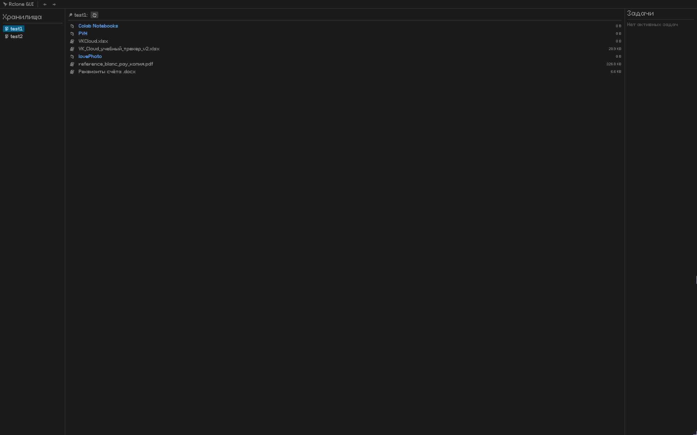

# Rclone UI Manager

Кроссплатформенный графический интерфейс для [rclone](https://rclone.org/), написанный на Rust с использованием [egui](https://github.com/emilk/egui). Приложение предоставляет удобный способ управления облачными хранилищами (Google Drive, Dropbox, S3 и др.) и локальными файлами, поддерживает копирование, перемещение, удаление и синхронизацию с отображением хода выполнения операций.



## Возможности

- **Автоматическая установка rclone** – обнаруживает системный rclone или загружает последнюю версию автоматически.
- **Управление удалёнными хранилищами (remotes)** – просмотр, проверка и использование всех настроенных в rclone подключений.
- **Локальный файловый менеджер** – навигация по локальной файловой системе, выбор папок назначения.
- **Основные файловые операции**:
  - Копирование / Перемещение / Удаление нескольких файлов или папок.
  - Рекурсивная обработка директорий.
- **Фоновые задачи** – асинхронные операции с индикаторами прогресса и статусом выполнения.
- **История навигации** – кнопки «Назад» / «Вперёд» для быстрого перемещения.
- **Пользовательские шрифты** – поддержка Sans.otf и NotoColorEmoji.ttf для улучшенного внешнего вида (опционально).
- **Кроссплатформенность** – работает на Windows, macOS и Linux.

## Системные требования

- **Rust** (при сборке из исходников) – стабильный инструментарий.
- **Cargo** – входит в состав Rust.
- **Операционная система** – Windows 10/11, macOS 10.15+ или современный дистрибутив Linux.
- **rclone** – не требуется, приложение загрузит его при необходимости.

## Установка

### Готовые сборки (пока не предоставляются)

В будущих релизах могут быть добавлены исполняемые файлы. Пока что собирайте из исходников.

### Сборка из исходников

1. Клонируйте репозиторий:
   ```bash
   git clone https://github.com/yourusername/rclone-ui-manager.git
   cd rclone-ui-manager
   ```

2. (Опционально) Поместите пользовательские шрифты в папку `assets/fonts/`:
   - `Sans.otf`
   - `NotoColorEmoji.ttf`

3. Соберите и запустите:
   ```bash
   cargo run --release
   ```

   Первый запуск может занять некоторое время из-за компиляции зависимостей. Исполняемый файл появится в `target/release/rclone-ui-manager` (или `rclone-ui-manager.exe` на Windows).

### Зависимости для Linux

На Linux могут потребоваться следующие системные библиотеки:

```bash
# Ubuntu / Debian
sudo apt install libx11-dev libxrandr-dev libxinerama-dev libxcursor-dev libxi-dev libwayland-dev pkg-config

# Fedora
sudo dnf install libX11-devel libXrandr-devel libXinerama-devel libXcursor-devel libXi-devel wayland-devel pkgconf
```

## Использование

1. Запустите приложение.
2. На левой боковой панели отобразится список ваших rclone remote (если они есть). Если remotes не настроены, используйте командную строку rclone для их добавления – в будущих версиях появится графический интерфейс для настройки.
3. Нажмите на имя remote, чтобы просмотреть его содержимое.
4. Выберите файлы/папки, щёлкая по их иконке (📁 или 📄). Можно выбирать несколько элементов.
5. После выбора внизу появятся кнопки: **Копировать**, **Переместить**, **Удалить**.
6. Для копирования/перемещения укажите путь назначения:
   - **Облако** – введите путь в формате rclone (например, `gdrive:/backup`).
   - **ПК** – выберите локальную папку через встроенный файловый браузер или введите путь вручную.
7. Нажмите **Начать** – операция запустится в фоне. Прогресс отображается на правой панели.

### Навигация

- **⬅ / ➡** – переход назад / вперёд по истории.
- **🔄** – обновить текущую директорию.
- **📁 .. (Вверх)** – подняться на уровень выше.

### Обработка ошибок

Сообщения об ошибках появляются во всплывающих окнах. Активные задачи перечислены на правой панели. Вы можете закрыть приложение, пока операции выполняются (они запускаются в отдельных потоках).

## Конфигурация

Приложение хранит настройки в стандартной пользовательской папке данных:
- Windows: `%APPDATA%\rclone-ui\`
- macOS: `~/Library/Application Support/rclone-ui/`
- Linux: `~/.local/share/rclone-ui/`

Сейчас в `AppSettings` хранятся только некоторые параметры (показ скрытых файлов, ограничение скорости). В будущих версиях они будут доступны через интерфейс.

## Разработка

### Структура проекта

```
src/
├── main.rs                     # Точка входа, загрузка шрифтов
├── ui.rs                       # Состояние UI и типы
├── ui/
│   ├── app.rs                  # Реализация egui::App
│   └── rcloneui.rs             # Логика UI, фоновые задачи
├── operations/
│   ├── files.rs                # Обёртка над rclone lsjson
│   ├── sync.rs                 # copy/move/delete/purge
│   ├── remotes.rs              # list/get/create/update/delete remotes
│   ├── local_fs.rs             # Чтение локальных директорий
│   ├── fileinfo.rs             # Вспомогательные методы FileInfo
│   └── ...                     # info, search, check
└── rclone_install/
    ├── mod.rs                  # Определение RcloneApp
    └── rclone_install_real.rs  # Обнаружение и загрузка rclone
```

### Добавление новых функций

- **Новые операции с remotes** – расширяйте `operations/remotes.rs`.
- **Дополнительные команды файловых операций** – реализуйте в `operations/sync.rs` и вызывайте из `RcloneUI`.
- **Новые панели UI** – используйте `egui::SidePanel`, `CentralPanel` или `Window`.

### Тестирование

Запуск всех тестов:

```bash
cargo test
```

Некоторые тесты помечены как `ignore` (например, реальная загрузка rclone) – запустите их командой `cargo test -- --ignored`.

## Устранение неполадок

### «Rclone not found» / ошибка установки

- Проверьте интернет-соединение – приложение скачивает rclone с GitHub.
- На Linux убедитесь, что установлен `unzip` (хотя crate `zip` не требует его, но для ручной проверки может понадобиться).
- При работе через корпоративный прокси установите переменные окружения `HTTP_PROXY` и `HTTPS_PROXY`.

### Отсутствие шрифтов

Приложение нормально работает со стандартными системными шрифтами. Поместите файлы шрифтов в `assets/fonts/`, чтобы изменить внешний вид.

### Ошибки компиляции на Linux

Установите все необходимые пакеты для разработки X11 (см. раздел «Зависимости для Linux»).

### Приложение не показывает локальные директории на Windows

Локальный браузер по умолчанию открывает `C:\`. Чтобы перейти на другой диск, введите путь вручную (например, `D:\`) в поле назначения.

## Планы на будущее

- [ ] Графическая настройка remote (создание/изменение).
- [ ] Предварительный просмотр синхронизации (dry-run со списком файлов).
- [ ] Ползунок ограничения скорости.
- [ ] Поиск файлов по имени/пути.
- [ ] Поддержка фильтров rclone (`--include`, `--exclude`).
- [ ] Отображение информации о ёмкости хранилища (rclone about).
- [ ] Переключение светлой/тёмной темы.

## Лицензия

Проект лицензируется на условиях **MIT License** или **Apache License 2.0** на ваш выбор. Файл `LICENSE` будет добавлен позднее.

## Участие в разработке

Приветствуются любые вклады! Пожалуйста, создавайте issue или pull request. Соблюдайте существующий стиль кода и по возможности добавляйте тесты.

## Благодарности

- [rclone](https://rclone.org/) – основа всех операций с хранилищами.
- [egui](https://github.com/emilk/egui) – библиотека для мгновенного GUI.
- [tokio](https://tokio.rs/) – асинхронная среда выполнения для загрузки rclone.
- [dirs](https://crates.io/crates/dirs) – кросс-платформенное определение директорий.

---

**Наслаждайтесь удобным управлением вашими облачными файлами!**
